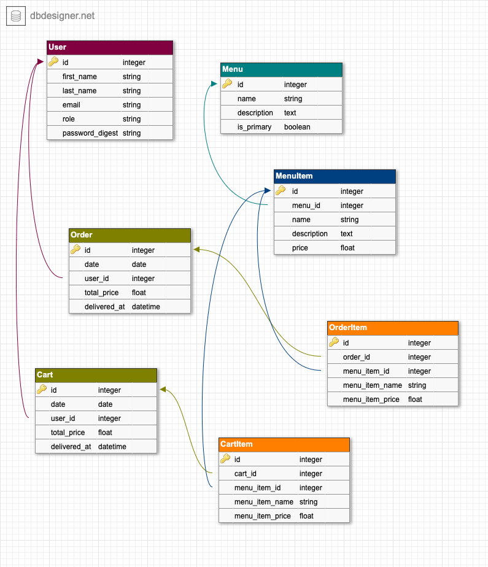

# Cafeteria Manager

This is a cafeteria maganement application for supporting multiple roles (customers, billing clerks and owner). Build with Ruby on Rails!

## A brief demo video of the application
[](http://www.youtube.com/watch?v=8gechr-uAEY "Application Demo")


## Features of the app
- [x] Signup, Signin for customers.
- [x] Signin for Owner.
- [x] Owner should add menu and menu items.
- [x] Customer should be able to place order.
- [x] Owner should be able to mark the order as delivered.
- [x] Customers should be able to check their order status
- [x] Customers should be able to see their order details

## Sample User details
**Admin**
```
email: admin@admin.com
password: admin@1234
```

**Customer**
```
email: adcb@xyz.com
password: abcd@1234
```


## Database Schema

